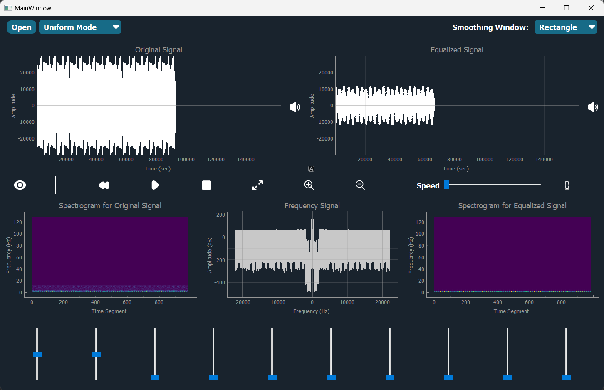
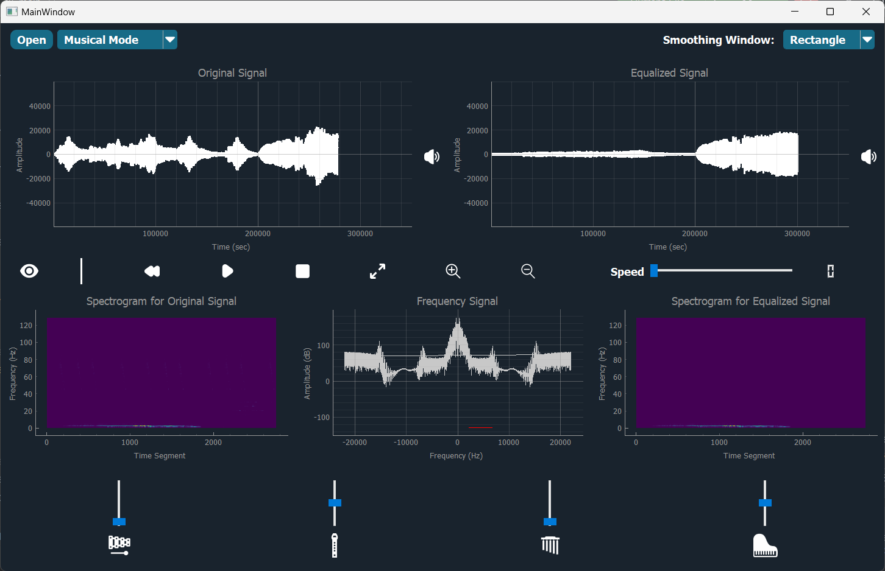
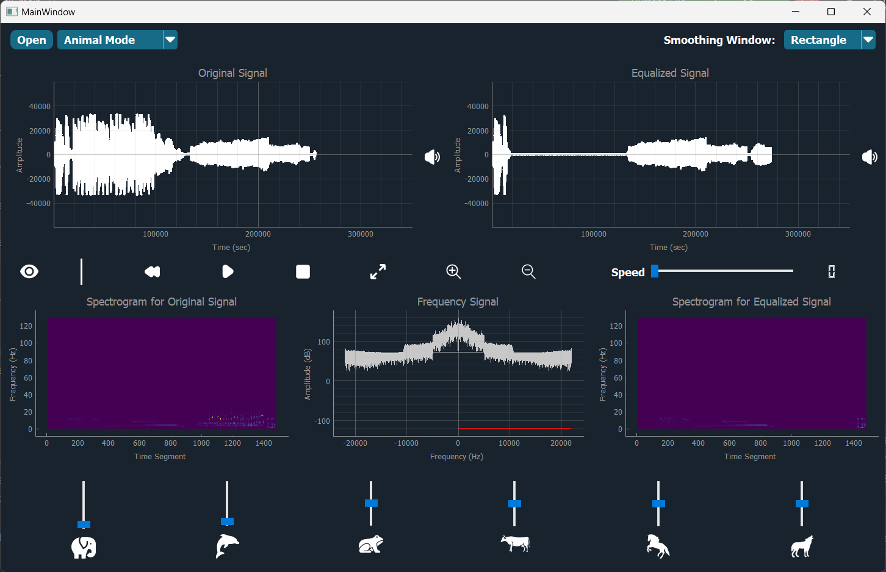
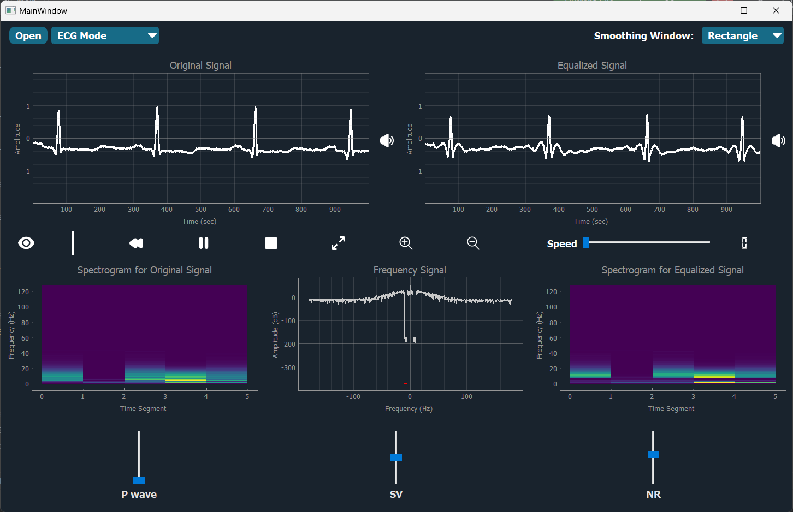

# Signal Equalizer Desktop Application

Signal equalizer is a fundamental tool in the music and speech industry and in various biomedical applications like hearing aid abnormalities detection. This project involves developing a desktop application that allows users to modify the magnitude of specific frequency components of a signal using sliders, and then reconstruct the signal with the applied changes.

<p align="center">
  
</p>


## Table of Contents
1. [Description](#description)
2. [Features](#features)
3. [User Interface](#user-interface)
4. [How to Use](#how-to-use)
5. [Dependencies](#dependencies)
6. [Installation](#installation)
7. [Contributors](#contributors)


## Description
The application will support multiple modes, each with a different use case:

1. **Uniform Range Mode**: <br>
The total frequency range of the input signal is divided uniformly into 10 equal ranges, each controlled by a slider.



2. **Musical Instruments Mode**: <br>
Each slider controls the magnitude of a specific musical instrument in an input music signal that includes at least four different instruments.



3. **Animal Sounds Mode**: <br>
Each slider controls the magnitude of specific animal sounds in a mixture of at least four different animal sounds.



4. **ECG Abnormalities Mode**: <br>
Three ECG signals with specific types of arrhythmias. Each slider controls the magnitude of an arrhythmia component in the input signal.



 ## Features
 
- **User-Friendly Interface**: Intuitive and easy-to-navigate interface for seamless user experience.
  
- **Frequency Manipulation**: The application allows users to modify the magnitude of specific frequency components using sliders.
  
- **Smoothing Windows**: Users can choose from four smoothing windows (Rectangle, Hamming, Hanning, Gaussian) and customize their parameters.
  
- **Mode Switching**: The user can switch between different modes easily through an option menu or combobox. The main change in UI when switching modes is the slider captions and the number of sliders.

- **Cine Signal Viewers**: Two linked viewers for the input and output signals with full functionality (play/stop/pause/speed-control/zoom/pan/reset) ensuring synchronous display of signals.

- **Spectrograms**: Two spectrograms for input and output signals, reflecting changes made by the equalizer sliders. Users can toggle the visibility of the spectrograms.


## User Interface
The user interface includes the following components:

- **Sliders**: For adjusting the magnitude of frequency components. The number and captions of sliders will vary based on the selected mode.
  
- **Cine Signal Viewers**: Two linked viewers for input and output signals with synchronized display and full control panel.
  
- **Spectrograms**: Visual representation of the frequency spectrum of input and output signals, with an option to show or hide them.
  
- **Smoothing Window Options**: UI for selecting and customizing smoothing windows.


## How to Use
1. **Open a Signal**:
Load a signal file into the application.

2. **Select Mode**:
Choose the desired mode (Uniform Range, Musical Instruments, Animal Sounds, ECG Abnormalities) from the options menu.

3. **Adjust Sliders**:
Use the sliders to modify the magnitude of specific frequency components.

4. **Choose Smoothing Window**:
Select a smoothing window and customize its parameters through the UI.

5. **Visualize Changes**:
Observe the changes in the linked cine signal viewers and spectrograms.

6. **Reconstruct Signal**:
Apply the changes to reconstruct the signal with the modified frequency components.


## Dependencies
This project requires the following Python packages listed in the `requirements.txt` file:
- PyQt5
- opencv
- numpy
- scipy
- pyaudio
- pandas
  

## Installation
To install the project, clone the repository and install the requirements:

```bash
# Clone the repository
git clone https://github.com/omarshaban02/Signal-Viewer.git
```
```bash
# Navigate to the project directory
cd Signal-Viewer
```
```bash
# Install the required packages:
pip install -r requirements.txt
```
```bash
# Run the application:
python index.py
```


## Contributors <a name = "contributors"></a>
<table>
  <tr>
    <td align="center">
    <a href="https://github.com/AbdulrahmanGhitani" target="_black">
    
    <br />
    <sub><b>Abdulrahman Shawky</b></sub></a>
    </td>
<td align="center">
    <a href="https://github.com/omarnasser0" target="_black">
    
    <br />
    <sub><b>Omar Abdulnasser</b></sub></a>
    </td>
         <td align="center">
    <a href="https://github.com/AhmedKamalMohammedElSayed" target="_black">
    
    <br />
    <sub><b>Ahmed Kamal</b></sub></a>
    </td>
         <td align="center">
    <a href="https://github.com/AbdullahOmran" target="_black">
    
    <br />
    <sub><b>Abdullah Omran</b></sub></a>
    </td>
      </tr>
 </table>


<!--
 <h2>Features</h2>
The user can browse their PC to open any signal file. Each signal type should have examples of both normal and abnormal signals.
The application contains two main identical graphs. Each graph can display different signals, and the user can control each graph independently or link them together.
When a signal file is opened, it is displayed in cine mode, simulating a running signal over time.
The user can manipulate the running signals through various UI elements, including changing color, adding labels/titles, showing/hiding signals, controlling cine speed, zooming in/out, pausing/playing/rewinding signals, and scrolling/panning the signal in any direction.
Signals can be moved between graphs.
The application takes care of boundary conditions to ensure signals are displayed within appropriate ranges.
The user can generate reports of snapshots from the graphs, including data statistics such as mean, standard deviation, duration, minimum, and maximum values for each signal. The report is generated in PDF format directly from the code. -->
